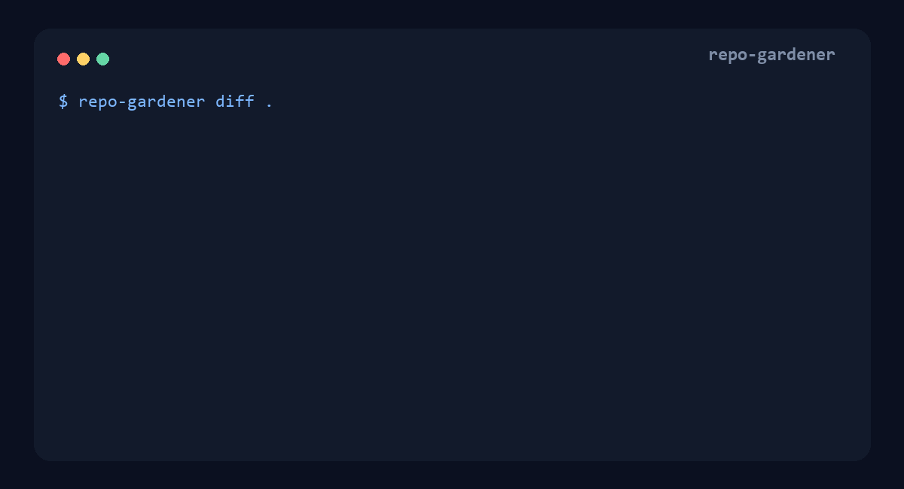

# AI Repo Gardener

**Find files the AI forgot to delete.**

AI Repo Gardener is a deterministic garbage collector for AI-edited Python
repositories. The package, CLI, and portable Skill keep the concise
`repo-gardener` identifier. Version `0.1.0a7` covers three evidence systems:
repository garbage collection, folder-architecture pressure, and
baseline-relative Python house-style drift. Weak guesses never become
automatic deletions or automatic moves.



```text
$ repo-gardener diff .

[HIGH] stale-file  parser_v2.py -> parser.py
  confidence 100%  risk 0%  action safe_delete_candidate
  - call_site_migration: app.py
  - git_chronology: replacement_added_later
  - inbound_imports: 0

$ repo-gardener fix . --dry-run
DELETE parser_v2.py  (replacement: parser.py, confidence: 100%)
```

Both commands default to `--base HEAD`, so their Git evidence connects without
repeating an option. Use an explicit ref on both commands when auditing a
committed range.

## What v0.1 supports

- `stale-file`: a whole Python file has a reachable, structurally similar
  replacement plus evidence such as call-site migration or Git chronology.
- `orphan-file`: a file changed in the current iteration is unreachable, has
  zero inbound imports, and has no plausible replacement. This is always
  review-only.
- `orphan-helper`: an unreferenced top-level helper, with private/exported/API
  boundaries kept explicit. This is always review-only.
- `duplicate-implementation`: substantial top-level functions with an exact
  normalized-AST match across files. It proposes consolidation review, never
  deletion.
- `dependency-leftover`: a runtime dependency declared by `pyproject.toml`,
  `requirements.txt`, `requirements/*.txt`, `setup.cfg`, or literal
  `setup.py`, with no matching static/runtime import. Distribution/import-name
  uncertainty remains visible and the result is review-only.
- Safe deletion: isolated-copy validation before mutation, snapshot, SHA-256
  verification, symlink and path-escape refusal, stale-plan rejection, and
  manual restore. Apply remains experimental.
- Both conventional `src/package` imports and literal `src.package` imports.
- Worktree, staged, committed-range, and untracked changes in `diff` mode.
- Built-in entrypoint recognition for FastAPI, Flask, Django, Click, and Typer.
- Alias-propagating runtime reference detection for `importlib`, `runpy`,
  `builtins`, `pkgutil`, `pkg_resources`, file-path loaders, module-shaped
  strings, and escaped dynamic-loader callables.
- Python packaging roots from `pyproject.toml`, `setup.cfg`, and literal
  `setup.py` entry points. Setuptools `py_modules` declarations are protected
  as public distribution APIs; unresolved legacy metadata disables auto-delete.
- Stable versioned JSON for agents and CI.
- Python standard library only at runtime; no model call, account, telemetry,
  API key, or network access.

The symbol and dependency rules are deliberately conservative static evidence,
not proof that a public API, plugin dependency, CLI tool, or reflective caller
is unused.

## Try the alpha

Python 3.11+ is required.

The hosted CI matrix is configured for Ubuntu, Windows, and macOS across
Python 3.11 through 3.14. Platform support is claimed from hosted runs, not
inferred from a single local machine.

```bash
python -m pip install .
repo-gardener diff /path/to/project --base HEAD~1
repo-gardener fix /path/to/project --base HEAD~1 --dry-run
```

Applying a deletion requires the exact JSON plan that was reviewed:

```bash
repo-gardener fix /path/to/project --dry-run --format json > reviewed-plan.json
repo-gardener fix /path/to/project --apply --plan reviewed-plan.json --validate "python -m pytest" --validation-timeout 300
```

The plan pins the base ref and SHA, HEAD SHA, effective configuration hash,
operation set, candidate/replacement hashes, and call-site evidence hashes.
Apply re-analyzes the repository and exits with an error if the current plan ID
differs from the reviewed plan.

The bundled Agent Skill is self-contained and can run without installation:

```bash
python skills/repo-gardener/scripts/run_repo_gardener.py diff /path/to/project --base HEAD~1
```

Copy `skills/repo-gardener/` into a compatible agent's skill directory. It
follows the open [Agent Skills specification](https://agentskills.io/specification).

## Commands

| Command | Purpose | Mutation |
| --- | --- | --- |
| `scan` | Run the supported repo-GC rules | Never |
| `stale` | Run file-, symbol-, duplicate-, and dependency-level repo GC | Never |
| `diff [--base <ref>]` | Audit committed, worktree, staged, and untracked iteration changes; base defaults to `HEAD` | Never |
| `fix [--base <ref>] --dry-run` | Preview matching high-confidence deletions; base defaults to `HEAD` | Never |
| `fix [--base <ref>] --dry-run --format json` | Emit the reviewed plan contract | Never |
| `fix --apply --plan <json> --validate <cmd> [--validation-timeout <seconds>]` | Experimental: validate the reviewed deletion in an isolated copy, reverify the original, then apply it | Yes |
| `fix --restore` | Restore the latest operation | Yes |
| `structure` | Run experimental directory analysis explicitly | Never |
| `style --baseline <ref-or-date>` | Run experimental repo-relative Python style analysis | Never |
| `scan --experimental` | Add structure and style to a full scan | Never |

### Review-only architecture and style analyzers

Structure and style remain opt-in and non-mutating. They do not run in `scan`
or `diff` unless `--experimental` is supplied.

Structure reports a deterministic 0–100 pressure score with flatness,
directory load, cohesion, generic-module pressure, and domain-fragmentation
factors. Domain affinity combines imports, recent Git co-change history, and
symbol vocabulary. Credible partitions include a target folder, exact file
moves, importer rewrite count, string-reference evidence, and risk. Plans set
`apply_supported: false`; one giant connected component is still reported only
as factual directory load rather than a fabricated partition.

Style findings are deviations from a baseline, never proof of AI authorship.
For repositories already dominated by generated code, provide a pre-AI commit
or date:

```bash
repo-gardener style . --baseline HEAD~20 --confidence all
repo-gardener style . --baseline 2026-01-15 --confidence all
```

The extractor includes Python-specific conventions: builtin vs `typing`
generics, `X | None` vs `Optional[X]`, `Path` vs `os.path`, comprehension vs
manual-loop preference, dataclass/TypedDict vs bare dictionaries, and logging
vs `print`. It also measures branch/cyclomatic complexity, private-helper
ratio, snake-case function naming, and function-name word count. Ratio features
carry their observation support; low-support conventions such as one `Path`
call are excluded before scoring. Fewer than five supported baseline files
produces no finding; fewer than 20 cannot produce high confidence.

## Safety and configuration

Every mutating run requires validation. Protected paths, generated code,
migrations, plugin paths, package APIs, dynamic references, partial
replacements, orphan findings, structure findings, and style findings are never
automatic deletion candidates.

Any Python parse error disables automatic deletion across the repository while
still allowing review findings. The same veto applies to opaque runtime loading,
including `eval`/`exec`, reflected import callables, non-literal imports, and
`pkgutil`/`pkg_resources` module discovery. The veto also covers loaders stored
in containers or passed as values, plus `runpy.run_path`,
`spec_from_file_location`, and importlib file loaders. Literal module-shaped
strings raise risk only when they resolve to a module that exists in the
repository.

Setuptools modules declared through `py-modules`/`py_modules` remain visible as
review findings but can never pass the automatic-deletion gate. Configuration
types are strict: quoted booleans such as `allow_delete_src = "false"` are an
error, not a truthy safety override.

### What the default package protection means

By default, only files at the repository root can pass the automatic-deletion
risk gate. Every Python file inside a subdirectory is review-only, including an
implicit namespace package without `__init__.py`.

| Layout | Default result for an otherwise strong stale-file finding |
| --- | --- |
| `parser_old.py` at repository root | Eligible for `safe_delete_candidate` |
| `app/parser_old.py` without `app/__init__.py` | Review: possible implicit namespace API |
| `app/parser_old.py` with `app/__init__.py` | Review: possible package API |
| `src/pkg/parser_old.py` | Review: package and `src/` protection |

To make reviewed application-internal package files eligible, the repository
owner must explicitly opt out of both protections:

```toml
[safety]
allow_delete_src = true
allow_delete_package_modules = true
```

Copy [`repo-gardener.toml.example`](repo-gardener.toml.example) to
`repo-gardener.toml` to declare entrypoints, protected paths, exclusions,
validation commands, and analysis thresholds. Only enable these safety
overrides after confirming that the package is application-internal rather than
a public or plugin-facing API.

Validation commands read from the target repository are untrusted and ignored
by default. Prefer explicit `--validate` arguments. `--trust-repo-config` is an
opt-in to execute commands supplied by that repository and should only be used
after review. Validation runs against an isolated copy where the planned
candidate files have already been removed. Only after validation succeeds does
AI Repo Gardener reverify the original hashes and perform the real deletion.
Relative-path validation side effects stay in the disposable copy. This is not
a command sandbox: commands that address absolute paths or external services
can still affect them. Each command has a 300-second default timeout; set a
different positive limit with `--validation-timeout`.

Applied fixes store recoverable snapshots under `.repo-gardener/`. Add this
line to the target repository's `.gitignore`:

```gitignore
.repo-gardener/
```

Rollback snapshots and state files are confined to `.repo-gardener/`; symlinks
at the state root or any rollback path are refused. Manual rollback restores the
deleted candidate files. Validation does not run in the original working tree,
so its ordinary relative-path cache, coverage, generated-file, or test-fixture
side effects are discarded with the isolated copy.

The JSON contract is documented in
[`skills/repo-gardener/references/finding-schema.md`](skills/repo-gardener/references/finding-schema.md).

## Alpha limits

The fixture suite covers stale replacements, partial replacements, dynamic
string paths, plugins, literal `src.*` imports, file and helper orphans,
duplicate implementations, dependency leftovers, rename chronology, style
support/baselines, co-change affinity, entropy, and move-plan examples. Public-repository
smoke results and exact commit hashes are recorded in
[`benchmarks/real-world-smoke.md`](benchmarks/real-world-smoke.md). That run is
not a labeled precision benchmark. The separate adversarial safety gate is
recorded in [`benchmarks/safety-benchmark.md`](benchmarks/safety-benchmark.md);
it reports eligible-deletion false positives rather than claiming population
precision.

Repository safety overrides are honored during analysis without
`--trust-repo-config` (that
flag controls validation-command execution only), so review the repository
config before authorizing apply. The plan pins its effective configuration hash.

For CI, `--fail-on high`, `--fail-on medium`, and `--fail-on any` use exit codes
`1` for a reached finding threshold and `2` for tool/configuration errors.

## Development

```bash
python -m pip install -e ".[dev]"
python -m pytest
ruff check .
ruff format --check .
python skills/repo-gardener/scripts/run_repo_gardener.py scan . --confidence all
```

The demo asset is reproducible with Pillow installed:

```bash
python scripts/render_demo.py
```

Contributions must add or update a reusable fixture for every false positive or
new evidence rule.

## License

MIT
