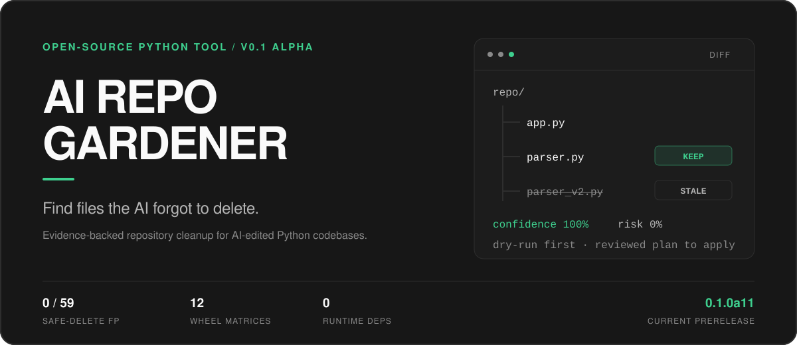

<p align="center">
  <a href="README.md">English</a> ·
  <a href="README.zh-TW.md">繁體中文</a> ·
  <strong>简体中文</strong> ·
  <a href="README.ja.md">日本語</a>
</p>

<p align="center">
  <a href="https://github.com/niansia/ai-repo-gardener/actions/workflows/ci.yml"></a>
  <a href="https://pypi.org/project/repo-gardener/"></a>
  <a href="https://pypi.org/project/repo-gardener/"></a>
  <a href="https://github.com/niansia/ai-repo-gardener/releases/tag/v0.1.0-alpha.11"></a>
</p>

AI Repo Gardener 是面向 AI 修改过的 Python 仓库的确定性垃圾回收器和 Agent Skill。
它能找出已被替代的文件、遗忘的 helper、重复实现、残留依赖、目录结构压力，以及
偏离仓库自身 Python 风格的代码；全程不调用模型、不上传源码，也不会把薄弱猜测
变成删除操作。

> **版本状态：** `0.1.0a11` 是 **v0.1** 系列的第 11 个 alpha。
> 稳定版 `0.1.0` 尚未发布。Repo GC 是当前 alpha 的核心功能；架构与
> house-style 分析仍属于实验性、仅供审查的功能。

## 30 秒开始使用

需要 Python 3.11 或更高版本。

```bash
python -m pip install "repo-gardener==0.1.0a11"
repo-gardener diff .
repo-gardener fix . --dry-run
```

也可以不安装，直接运行一次：

```bash
uvx --from "repo-gardener==0.1.0a11" repo-gardener diff .
```

`diff` 和 `fix` 都默认使用 `--base HEAD`，因此审查时看到的 Git 证据会自然延续到
dry-run。审计其他 commit 范围时，请在两个命令中使用相同的明确 Git ref。


## 三套证据系统

| 系统 | 回答的问题 | 状态 | 从这里开始 |
| --- | --- | --- | --- |
| **Repo GC** | 最新一轮 AI 修改替代、遗弃、重复或留下了什么？ | Alpha 核心 | `repo-gardener diff .` |
| **Architecture Gardener** | 某个目录是否承载了太多无关代码？合理的迁移方案是什么？ | 实验性、仅供审查 | `repo-gardener structure . --confidence all` |
| **House-style Gardener** | 哪些 Python 文件偏离了此仓库自身的基准风格？ | 实验性、仅供审查 | `repo-gardener style . --baseline HEAD~20 --confidence all` |

Repo GC 包含 `stale-file`、`orphan-file`、`orphan-helper`、
`duplicate-implementation` 和 `dependency-leftover`。Structure 会生成带评分但不会
自动执行的 migration proposal。Style 会将 typing、路径、comprehension、输出、
复杂度、wrapper、防御式判断、命名等 Python 信号，与仓库同类文件或 AI 介入前的
commit／日期作比较。Style finding 只表示风格漂移，不能证明文件由 AI 编写。

## 作为 Agent Skill 使用

PyPI wheel 已包含完整的可移植 Skill。先安装 CLI，再取得内置 Skill 的实际路径：

```bash
python -m pip install "repo-gardener==0.1.0a11"
repo-gardener skill-path
```

请只选择你实际使用的 agent 目标。项目级安装位置使用仓库内相同的目录名称。

| Agent | 个人 Skill 位置 | 项目 Skill 位置 | 调用方式 |
| --- | --- | --- | --- |
| [OpenAI Codex](https://developers.openai.com/codex/skills/) | `~/.agents/skills/repo-gardener` | `.agents/skills/repo-gardener` | `$repo-gardener` 或 `/skills` |
| [Claude Code](https://code.claude.com/docs/en/skills) | `~/.claude/skills/repo-gardener` | `.claude/skills/repo-gardener` | `/repo-gardener` |
| [Cursor](https://cursor.com/docs/skills) | `~/.cursor/skills/repo-gardener` | `.cursor/skills/repo-gardener` | `/repo-gardener` |

### macOS / Linux

```bash
SKILL_SOURCE="$(repo-gardener skill-path)"

# OpenAI Codex
mkdir -p "$HOME/.agents/skills/repo-gardener"
cp -R "$SKILL_SOURCE"/. "$HOME/.agents/skills/repo-gardener/"

# 使用 Claude Code 时改用此位置
mkdir -p "$HOME/.claude/skills/repo-gardener"
cp -R "$SKILL_SOURCE"/. "$HOME/.claude/skills/repo-gardener/"

# 使用 Cursor 时改用此位置
mkdir -p "$HOME/.cursor/skills/repo-gardener"
cp -R "$SKILL_SOURCE"/. "$HOME/.cursor/skills/repo-gardener/"
```

### Windows PowerShell

```powershell
$SkillSource = repo-gardener skill-path

# 选择一个目标：
$Target = "$HOME\.agents\skills\repo-gardener" # OpenAI Codex
# $Target = "$HOME\.claude\skills\repo-gardener" # Claude Code
# $Target = "$HOME\.cursor\skills\repo-gardener" # Cursor

New-Item -ItemType Directory -Force $Target | Out-Null
Get-ChildItem -Force $SkillSource | Copy-Item -Destination $Target -Recurse -Force
```

请勿在同一个 agent 会扫描的多个位置安装重复副本。仓库中的
`skills/repo-gardener/` 也可以独立使用，并遵循开放的
[Agent Skills 规范](https://agentskills.io/specification)。

## 先审查，再应用完全相同的计划

只读命令不会修改仓库。删除文件需要一份精确的 JSON 计划、第二次相符的分析，
以及验证命令：

```bash
repo-gardener fix . --dry-run --format json > reviewed-plan.json

# 检查 reviewed-plan.json 后，应用这份完全相同的计划：
repo-gardener fix . --apply \
  --plan reviewed-plan.json \
  --validate "python -m pytest" \
  --validation-timeout 300
```

在 PowerShell 中，请把 apply 命令写成一行，或将每个 `\` 替换为 PowerShell 反引号。
Apply 会先在隔离副本中验证删除结果，再接触原始仓库，随后重新核对 plan identity 与
文件 hash。验证失败时原始仓库不会被修改；成功操作会保留可供
`repo-gardener fix . --restore` 使用的恢复快照。

计划会固定 base ref 与 SHA、HEAD SHA、有效配置、operation set、候选／替代文件
hash 和 evidence-file hash。仓库发生变化会生成不同计划，应用将被拒绝。

## 命令

| 命令 | 用途 | 会修改文件？ |
| --- | --- | --- |
| `scan .` | 运行受支持的 Repo GC 规则 | 否 |
| `stale .` | 聚焦文件、symbol、重复实现与依赖层级 GC | 否 |
| `diff . [--base <ref>]` | 审计 committed、staged、worktree 和 untracked 的迭代变化 | 否 |
| `fix . --dry-run` | 预览符合条件的高置信度删除候选 | 否 |
| `fix . --dry-run --format json` | 创建供审查的 plan contract | 否 |
| `fix . --apply --plan <json> --validate <cmd>` | 验证并应用完全相同的已审查计划 | **是** |
| `fix . --restore` | 恢复最近一次删除操作 | **是** |
| `structure . --confidence all` | 显式运行架构分析 | 否 |
| `style . --baseline <ref-or-date> --confidence all` | 显式运行相对基准的 style 分析 | 否 |
| `scan . --experimental` | 在完整扫描中加入 structure 与 style | 否 |
| `skill-path` | 显示 wheel 内置的可移植 Skill 路径 | 否 |

所有报告命令都支持供 agent 和 CI 使用的稳定 JSON。`--fail-on high`、
`--fail-on medium` 和 `--fail-on any` 达到阈值时返回 exit code `1`；工具或配置错误
返回 `2`。

## 证据，不是感觉

以下数字描述的是已发布、可复现的 gate，并非对所有仓库准确率的宣称。

| 已发布 gate | 当前结果 |
| --- | --- |
| Source suite | **182 个测试** |
| 破坏性安全对抗案例 | **0 / 59 个 eligible-deletion false positive** |
| Curated labeled corpus | **10 TP、0 FP、0 FN、10 TN**；在此 corpus 中 precision 与 recall 均为 100% |
| Release wheel | 同一个 wheel 通过 **12 种 OS/Python 组合**：Ubuntu、Windows、macOS × Python 3.11–3.14 |
| 固定版本的真实仓库 | requests、Flask、pandas、Django、FastAPI、pytest、Pydantic；**0 个 automatic-deletion candidate** |
| Hosted style benchmark | alpha.10 的 159.11s → alpha.11 的 97.51s；finding 完全相同，**快 38.7%** |

完整 fixture、commit、测试机器信息与限制：

- [对抗式安全 gate](benchmarks/safety-benchmark.md)
- [带标签的 precision／recall corpus](benchmarks/labeled-corpus.md)
- [固定版本真实仓库的 smoke 与性能测试](benchmarks/real-world-smoke.md)

## 安全边界

AI Repo Gardener 采取有意保守的策略：

- Parse error、不透明／动态加载、无法解析的 packaging metadata、templated deployment
  command 都会在整个仓库禁用自动删除。
- Framework root、packaging entry point、公开／package API、plugin、runtime string、
  generated code、migration 和 partial replacement 会受保护或只能人工审查。
- 默认只有仓库根目录的文件可以通过自动删除 risk gate。`app/`、`src/`、package
  与 namespace package 内的文件，除非 owner 明确调整两项安全配置，否则都只能审查。
- Architecture 与 style finding 永远不会移动或删除文件。
- 工具没有 runtime 第三方依赖、不调用模型或网络，也不发送源码或 telemetry。

已人工确认是应用内部 package 时，可以明确设置以下两个 override：

```toml
[safety]
allow_delete_src = true
allow_delete_package_modules = true
```

将 [`repo-gardener.toml.example`](repo-gardener.toml.example) 复制为
`repo-gardener.toml`，可配置 entrypoint、受保护路径、排除项、验证和阈值。建议显式
传入 `--validate`；仓库提供的验证命令默认会被忽略，只有添加
`--trust-repo-config` 才会执行。

已应用的操作会把可恢复状态写入 `.repo-gardener/`。请将它加入目标仓库的
`.gitignore`：

```gitignore
.repo-gardener/
```

完整 mutation policy 与 JSON contract 请参阅
[安全策略](skills/repo-gardener/references/safety-policy.md)和
[finding schema](skills/repo-gardener/references/finding-schema.md)。安全问题请按
[`SECURITY.md`](SECURITY.md) 报告。

## 开发与贡献

```bash
git clone https://github.com/niansia/ai-repo-gardener.git
cd ai-repo-gardener
python -m pip install -e ".[dev]"
python -m pytest
ruff check .
ruff format --check .
python skills/repo-gardener/scripts/run_repo_gardener.py scan . --confidence all
```

欢迎贡献。每个 false-positive 修复或新的 evidence rule 都必须附带可复用 fixture。
提交 pull request 前请先阅读 [`CONTRIBUTING.md`](CONTRIBUTING.md)。

## 许可证

[MIT](LICENSE)
